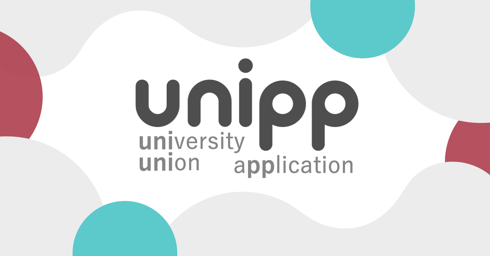

# はじめに

unipp-アプリ開発チームのドキュメントへようこそ！！

## unipp (ユニップ)とは

unipp は、全国の学生に、キャンパスライフを便利に過ごすための情報流通プラットフォームを提供することを目的としたアプリです。2022 年度から静岡大学浜松キャンパスの遊橋研究室の学生達を主導にアプリ開発が始動しました。

## unipp アプリ開発チームの目的

私たちの目的は**「大学生活の不便を ICT 技術で解消する」**ことです。

> 私たちはアプリの改善や機能を開発する際は、かならずこの目的を達成できるものなのかを考えています

## 一緒に頑張りましょう！

わからないことや、困ったことがあったらなんでも`slack`で先輩でも同期、もちろん後輩に頼ってください
