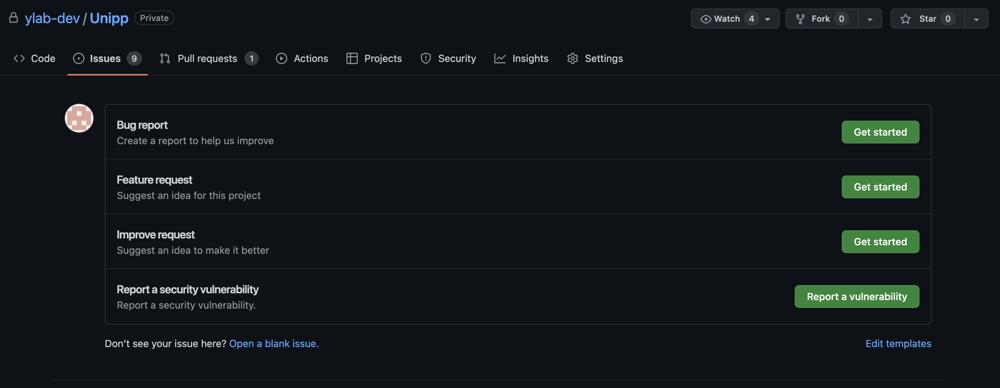
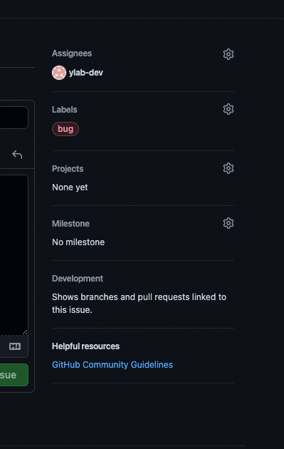

# unipp 開発フロー

unipp の開発開始から、開発終了までのフロー

## 0.issue の作成

- **このページ: https://github.com/ylab-dev/Unipp/issues**
  から、誰かが作成した issue を**選択**するか、新しく issue を**作成**してください

- 作成する場合は以下の項目から、テンプレートを選択して作成するようにしてください
  

- また、右の欄は、Assignees に自分を入れて、Labels に任意のラベルをつけてください。
  
  <br/>

## 1.ブランチを切る

次に、GitHub の issue に対応する作業ブランチを master から作成

> 新機能なら feat/〇〇、バグなら fix/〇〇、軽微な修正とかなら refactor/〇〇 <br/> > **とりあえず、何をするブランチなのかを明確にすることが大事**

```bash
git checkout -b ${prefix/hogehoge}

# 例1 ユーザページをを作る時
git checkout -b feat/userPage

# 例2 topページのunipp紹介文を変えるとき
git refactor -b refactor/topIntroduction

```

## 2.ローカルでの作業

自分のローカルで作業をする。このタイミングでは、コード規約や、コンポーネント設計などを考えながら実装を行う。

## 3.変更ををセーブする

`git add`ではローカルで作業したことをステージングエリアに渡します。
ステージングエリアにあげることで、コミット対象にすることができます。

> つまり、

```bash
# 一個ずつつやる場合
git add ${file-path}

# ローカルの変更を一気にステージングエリアに追加する
git add .
```

## 4.コミットメッセージを書く

git commit は git add したファイルを対象に`そのファイルはなにをしたのか`というメッセージを残します

```bash
git commit -m "${prefix}:hogehoge"
```

## 5.リモートリポジトリに変更を共有する

`git push`は自分のローカルで`git commit`したファイルを**Github**に共有します。

```bash
git push origin ${prefix/hogehoge}
```

> **${prefix/hogehoge}**: [1.ブランチを切る](#1ブランチを切る)で作成したブランチ名のこと

## 6.プルリクエスト作成

main ブランチに対して、プルリクエストを作成する。

1. Reviewers で誰かを選択する
2. タイトルはそのプルリクエストが**何をしたのかわかるタイトル**にする
3. コメント欄の最後には「issue#番号 doing or done」

## 7.レビューしてもらう

unipp では main ブランチ(ようはデプロイするコードが入ったブランチ)に反映させる際は、必ず誰かにレビューしてもらってから反映させます。

- プルリクを誰かに見てもらって**ok**をもらったらマージする

## 8.終了

- 基本的に 1~7 までの作業が基本的に開発時の流れになります。この流れは一般的な企業などでもあまり変わりません。
- ここまでの一連の作業をしっかりと身につけていきましょう！
