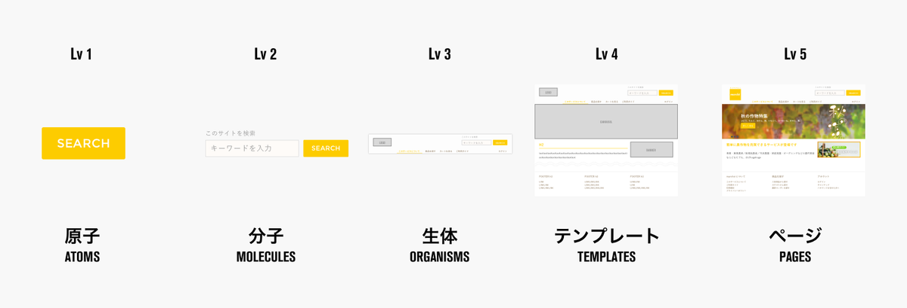

# Atomic design

unipp の UI 構築の際には、atomic design を利用しています。 
ここでは、**Atomic design とはなにか？** と、**unipp の Atomic Design のルール**が書いてあります

---

## Atomic design とは？

Web デザイナー Brad Frost 氏が考案・提唱したデザインシステム

ようはパーツ/コンポーネント単位で UI をデザインしていきましょうというデザイン手法です。

もっと知りたい人はこれ 👇 を呼んでもいいかも？  
[新しいデザインシステムの手法 Atomic Design とは｜ NEWS ｜株式会社 INDETAIL（インディテール）](https://www.indetail.co.jp/blog/10234/)

---

## Unipp における Atomic design ののルール

### Atoms (原子)

    - 汎用性を考慮
    - Button, Icon, Text, Title などの小さい単位のコンポーネントを定義する
    - margin を指定しない
    - unipp では、chakra-UI が atoms の役割を担っている

### Molecules (分子)

    - 汎用性を考慮
    - Atoms を組み合わせて作成
    - margin の指定可能
    - 外部 API とのやりとりは行ってはいけない

### Organisms (生体)

    - 汎用性を考慮しなくもいい
    - margin の指定可能
    - Atoms や Molecules を組み合わせて作成
    - 外部 API との連携を行っていい

### Layouts(templates の変わり)

    - 汎用性を考慮
    - 中身の内, pages のレイアウト
    - ただし、Unipp ではあまり利用しない。

### Pages

    - 汎用性を考慮しない
    - pages 内の全体的なレイアウト, データ取得や画像取得などのAPIとの連携は基本的にここで行う。

---
