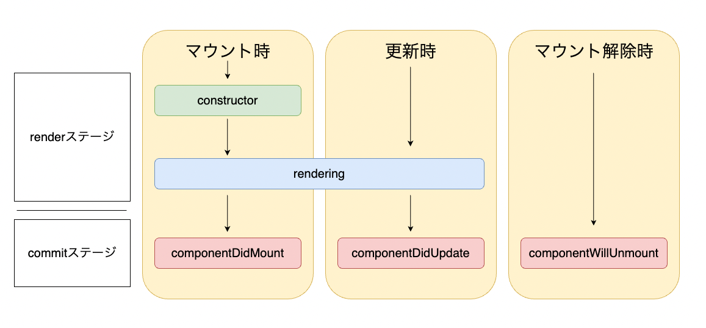

# React のライフサイクル

- React のライフサイクルは以下のようになっている

- 何気なく使ってる useState()た useEffect()などの ReactHooks はこれらの、マウントや更新時のタイミングをトリガーに実行してくれているので、ライフサイクルを理解することで、React のプログラムを好きなタイミングで動かせるようになる

#### 参考サイト

- [https://zenn.dev/web_tips/articles/8911d3b761c8f3](https://zenn.dev/web_tips/articles/8911d3b761c8f3)

- [Hooks 時代の React ライフサイクル完全理解への道](https://zenn.dev/yodaka/articles/7c3dca006eba7d)
