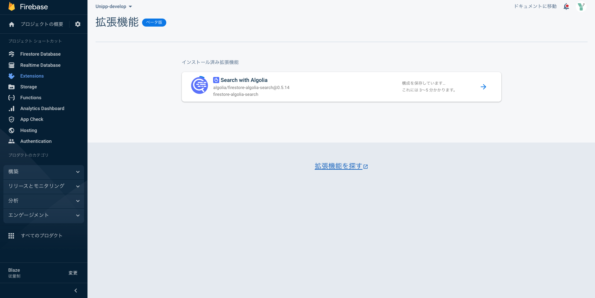

# algolia -firebase extention-

## algolia とは？

検索ライブラリのこと。aloglia を用いることで、firestore のデータを検索する機能を作ることができる

## algolia -firebase extention-

前までは自前でライブラリをインストールしなきゃいけなかったが、現在では firebase の拡張機能から利用可能になった。

## 使い方

### 1. Firebase>Extenstions のから**拡張機能を探す**をクリック

### 2. **Searh with Algolia**の**install**を選択する

### 3. 後は UI に従って、インストールしていけば、設定したコレクションで利用可能になる
