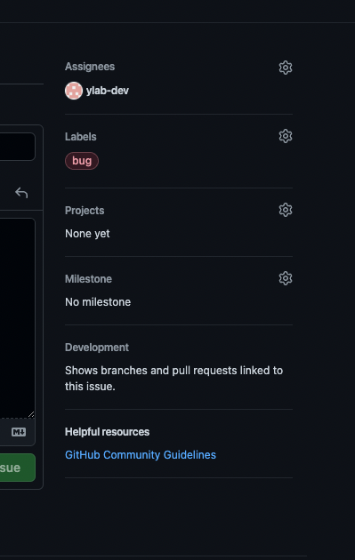

# github のフロー

add → commit → push の手順についてまとめた内容です。

## 0.issue の作成

- **このページ: https://github.com/ylab-dev/Unipp/issues**
  から、誰かが作成した issue を**選択**するか、新しく issue を**作成**してください

- 作成する場合は以下の項目から、テンプレートを選択して作成するようにしてください
  

- また、右の欄は、Assignees に自分を入れて、Labels に任意のラベルをつけてください。
  
  <br/>

## 1.ブランチを切る

次に、GitHub の issue に対応する作業ブランチを master から作成

> 新機能なら feat/〇〇、バグなら fix/〇〇、軽微な修正とかなら refactor/〇〇

```
git checkout -b feat/${hogehoge}
```

## (ローカルでの作業)

自分のローカルで作業をする。このタイミングでは、コード規約や、コンポーネント設計などを考えながら実装を行う。

## 1.ステージング

```
<!-- 一個一個やる場合 -->
git add ${file-path}

<!-- 一気にやりたい場合 -->
git add .
```

## 2.コミット

```
git commit -m "${prefix}:hogehoge"
```

## 3.push

```
git push origin ${your-branch-name}
```

## 4.プルリクエスト作成

main ブランチに対して、プルリクエストを作成する。

- Reviewers で誰かを選択する
- タイトルはそのプルリクエストが**何をしたのかわかるタイトル**にする
- コメント欄の最後には「issue#番号 doing or done」

## 5.レビューしてもらう

- プルリクを誰かに見てもらって**ok**をもらったらマージして、次の作業を始める
