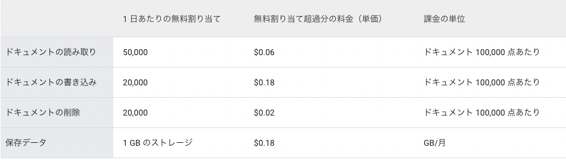

# firebase の料金体系

## サマリ

unipp では、バックエンドの機能(認証機能、データベース機能、クラウド実行関数など)は Firebase で実装している。
Firebase は基本的に従量課金制であるが、無料枠が設定されている。そこで、利用しているサービス毎に料金体系をまとめる

## firebase で利用しているサービス

- Authentication (ユーザ認証機能のため)
- Cloud Functions (クラウド関数実行のため)
- Cloud Firestore (データベース機能のため)
- Cloud Storage (写真や画像などのバイナリデータの保管のため)

## Authentication

- unipp はメールアドレスでの認証のため、料金はかからない
- 電話認証の場合だけ、月当たり 1 万認証まで無料で、それ以降は`$0.06/認証`かかる

## Cloud Functions

- クラウド上の関数を呼び出すために月当たり`200 万呼び出し`までが無料で、それ以降は `100 万呼び出し毎に$0.4`かかる

## Cloud Firestore

### 課金対象

- ドキュメントの読み取り数/日
- ドキュメントの書き込み数/日
- ドキュメントの削除数/日

### それぞれの料金

## Cloud Storage

- CloudStorage はバイナリデータが増える毎に料金が増えていき、 5 ギガバイトを超えた場合、`1ギガバイト当たり$0.023`毎月請求される

> パンプラージュの場合、5400 程ののバイナリデータ(15.13GB)が保存されており、42 円の請求をされた(2023 年 1 月時)

#### 参考

https://firebase.google.com/pricing?hl=ja
