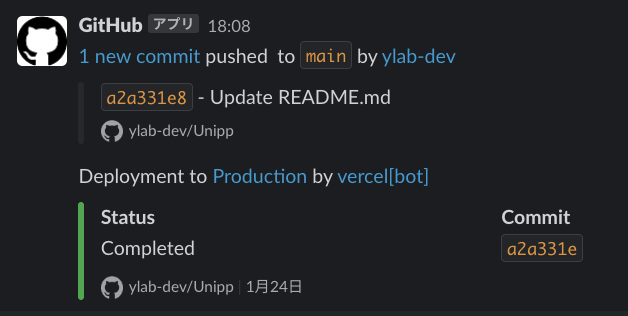
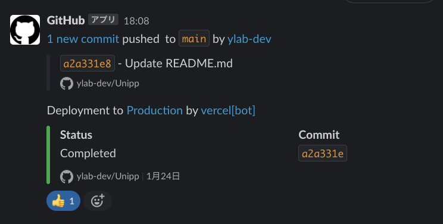

# デプロイ完了確認

## サマリ

unipp のデプロイは vercel を通して、自動で行われるが、デプロイ後は Slack に URL が送られるため、最終確認として、、目視での確認を行う。

### 1. Slack にデプロイ環境の通知が来る

開発者がプロダクションコードにコードをマージすると、以下の様に Slack の`develop-notify`に通知がくる  
(リアクションがあれば、これ以降は進まなくていい)

### 2. `Production`をクリックする

### 3. ページが開かれるのを確認する

以下が正常に開かれれば、デプロイされているのが確認できる

### 4. 確認したことを伝える

slack のリアクション機能を使って確認できた旨を伝える

