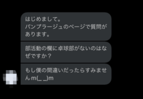

# Q&A 対応

## サマリ

ここでは、パンプラージュのユーザからの質問の Q&A についてまとめた
(unipp の Q&A の参考になることを願う)

## 前提

パンプラージュでの質問は twitter に送られてきていた。
そのため、twitter でユーザから質問を受けてから回答するまでのするまでの手順を記す

### Step.1 ユーザから質問を受ける

### Step.2 slack の `質問対応` へ投げる

- 回答可能な人を slack で探してください

### Step.3 回答を twitter でユーザに返す

